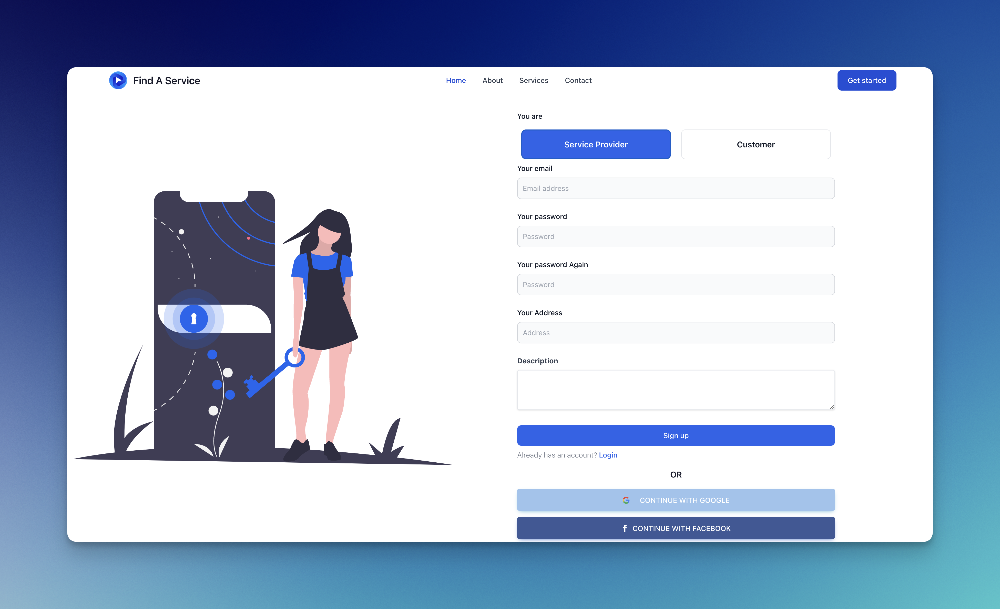

# COMP6251 Project

- Using the template from [vite-react-ts-tailwind-firebase-starter](https://github.com/TeXmeijin/vite-react-ts-tailwind-firebase-starter)
- [Linear](https://linear.app/find-a-service-project/project/find-a-service-project-0ed999db45f3/6251) for project management

## Libraries

- [React v18.2](https://github.com/facebook/react)
- [TypeScript](https://github.com/microsoft/TypeScript)
- [Tailwind CSS](https://tailwindcss.com/)
- [Firebase(v9, modular)](https://firebase.google.com/)
- [ESLint](https://eslint.org/)
- [Prettier](https://prettier.io/)
- [Vite](https://github.com/vitejs/vite)

## Set up

```shell
mv .env.local.example .env.local
# then edit .env.local via the document on linear.app
yarn
yarn dev
```

## Demo

for now, I have created the register and login page with firebase auth.
Note that the backend is changed to firebase since this one is recommended at lecture, and quite convenient based on this project's requirements.

